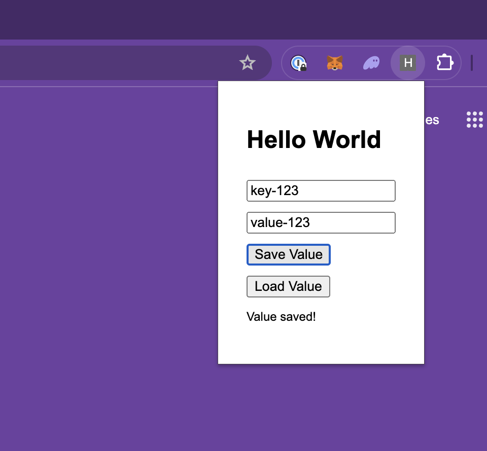

# set-value-from-extension
Take/create a simple hello world Chrome extension that stores some value via chrome.storage API.



# read-value-from-script
Create a script, in any language JavaScript / Python / Ruby / Rust to fetch that value from the local leveldb database on disk.

1. Find the location of the local leveldb database on disk.

```
$ find ~/ -type d -name "ghdmidohgjfoakfmjifbmhehabjlamka"
/Users/dongri//Library/Application Support/Google/Chrome/Profile 1/Sync Extension Settings/ghdmidohgjfoakfmjifbmhehabjlamka
```

2. Close Chrome when running the script.


