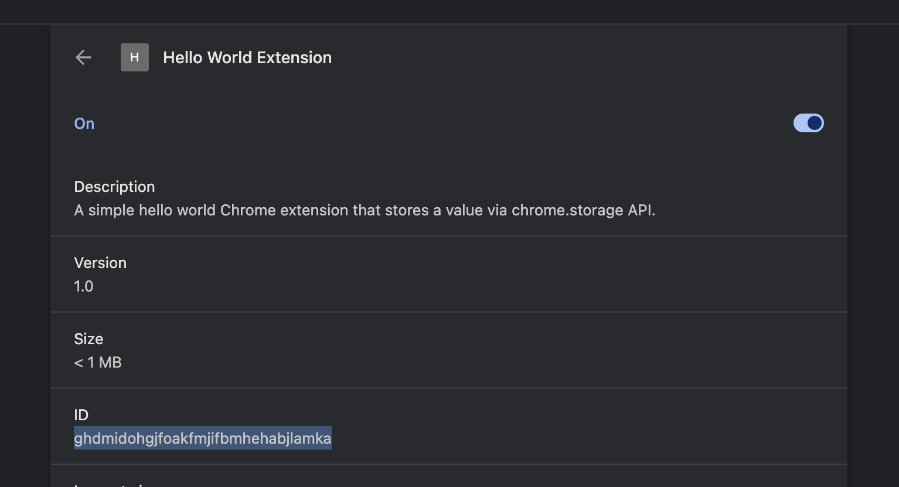

# chrome-exteion
Take/create a simple hello world Chrome extension that stores some value via chrome.storage API.

# script-leveldb
Create a script, in any language JavaScript / Python / Ruby / Rust to fetch that value from the local leveldb database on disk.

